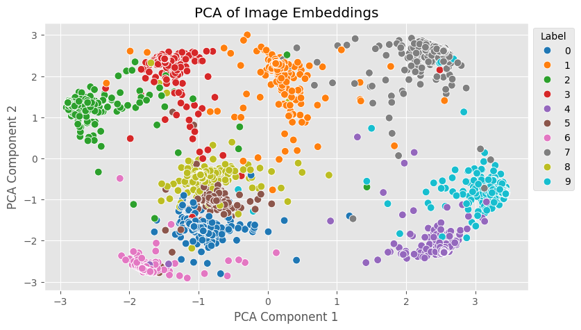

# Siamese Network on MNIST

This project implements a Siamese neural network in TensorFlow to perform similarity learning on the MNIST dataset.
The model is trained using triplet loss, where the network learns to distinguish between similar and dissimilar pairs of images.

## Model Description

The Siamese network architecture consists of a shared embedding model that maps input images into a lower-dimensional space.
The embeddings are then used to calculate the distance between images, allowing the model to learn which images are similar or dissimilar.
The network is trained with triplet loss, ensuring that the distance between anchor-positive pairs is minimized while the distance between anchor-negative pairs is maximized.

## Results

After training, the embeddings of the images were visualized using PCA.

